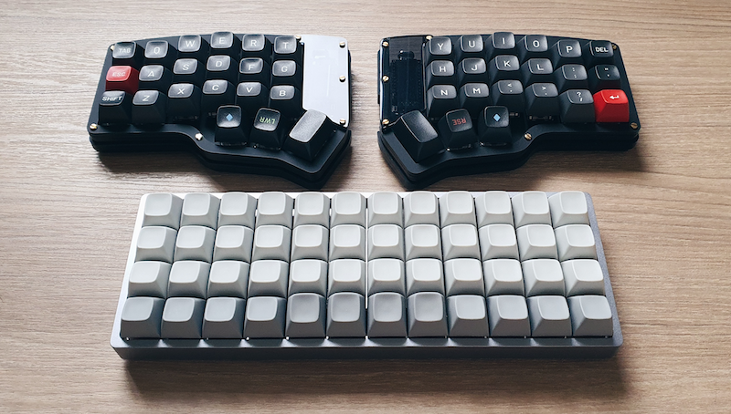

# Summary
My personal user space is a self-contained folder that avoids placing keymap files inside any keyboard directories. All customisation required to build QMK firmware is configured here in the following manner:

* Configure keyboard layout using [QMK Configurator](https://config.qmk.fm/#/) and export the JSON file with keymap named after this space.
* Create `rules.mk`, `config.h` and shared source codes in this folder, with `#ifdef` preprocessors for unique keyboard or feature specific functions.
* Run QMK compile on the exported JSON file to build a custom firmware for each board.
* See my [standalone userspace](https://filterpaper.github.io/qmk/userspace) guide for more details.

# Supported Keyboards


* [BM40 HS RGB](../../keyboards/bm40hsrgb) — Features layer key press effects, per key RGB modifier lights.
* [Planck rev6](../../keyboards/planck) — RGB underglow lights as layer and modifier indicators.
* [Corne Keyboard (CRKBD)](../../keyboards/crkbd) — Bongocat typing animation and graphical indicators on OLEDs.
* [The Mark: 65](../../keyboards/boardsource/the_mark) — RGB underglow effects as layer and modifier indicators.

# File Listing
File | Description
---- | -----------
rules.mk | QMK compile rules and hardware feature selection
config.h | QMK configuration variables and options, see [configuring QMK](../../docs/config_options.md)
filterpaper.h | User specific variables and options
filterpaper.c | User source with custom functions, see [RGB matrix lighting](../../docs/feature_rgb_matrix.md) and [custom quantum functions](../../docs/custom_quantum_functions.md)
bongo-cat-full.c | Bongocat aligned for left and right OLED (huge: ~8774 bytes)
bongo-cat-slim.c | Bongocat aligned for left and right OLED, without prep paws (large: ~7716 bytes)
bongo-cat-left.c | Bongocat aligned only for left OLED (small: ~4614 bytes)
bongo-cat-right.c | Bongocat aligned only for right OLED (small: ~4614 bytes)
mod-status.c | Graphical layer and modifier status module for primary OLED
glcdfont.c | Corne logo, コルネ katakana name, fonts and icon images—required by mod-status.c
rgb_matrix_user.inc | Custom RGB matrix effects collected from Reddit, see [Custom RGB Matrix](../../docs/feature_rgb_matrix.md#custom-rgb-matrix-effects-idcustom-rgb-matrix-effects)
json | Folder of supported keyboard layouts

# Build Commands
QMK will read "keyboard" and "keymap" values from the JSON file to build the firmware:
```
qmk compile ~/qmk_firmware/users/filterpaper/json/bm40.json
qmk compile ~/qmk_firmware/users/filterpaper/json/planck.json
qmk compile ~/qmk_firmware/users/filterpaper/json/corne.json
qmk compile ~/qmk_firmware/users/filterpaper/json/mark65.json
```

# Compiling the cat
Bongocat is a fun typing animation for a split keyboard's secondary OLED display. It is however space consuming because each frame is 512 bytes to fit the 128x32px OLED display. If keyboard configuration has minimal features and no RGB code, pick `bongo-cat-full.c` or `bongo-cat-slim.c` source to build a single firmware for both controllers. If compiled size exceeds limit, build with `bongo-cat-left.c` and `bongo-cat-right.c` separately to flash on each side. Bongocat source file selection is `#define BONGOCAT` in `filterpaper.h`.

# Corne Split Setup
Corne is configured with EE_HANDS for controllers to read left or right values off EEPROM, allowing USB-C cable to be used on either side. These are one-time flash commands to write left and right side values into both Elite-C MCUs:
```
qmk flash -kb crkbd/rev1/common -km default -bl dfu-split-left
qmk flash -kb crkbd/rev1/common -km default -bl dfu-split-right
```
Subsequently, the same firmware binary can be flashed normally to both sides. See [split keyboard features](../../docs/feature_split_keyboard.md) for details.

# QMK logo file
Images in `glcdfont.c` can be viewed and edited with:
* [Helix Font Editor](https://helixfonteditor.netlify.app/)
* [QMK Logo Editor](https://joric.github.io/qle/)
